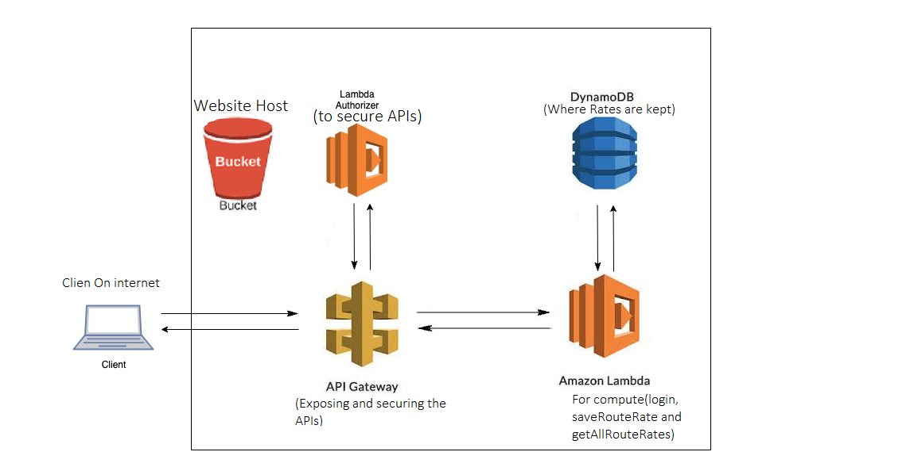

## Introduction

This repository contains the code for Microservices of Transport rates app. It also has the templates for Infrastrure provisioning and management, which uses SAM/CloudFormation. 

The entire stack all goes to AWS.

## Architecture Diagram

## Microservices Details.

These services are implemented in Lambda functions with Node.js. They are exposed via API gateway. The Authentication/login API is open to the internet, but the other Endpoint are ** Secured with Authorizer **, a user needs to send a Valid Cognito Token to send request to them.

The lambda function are as follow: 

1. Login - open to internet
2. WriteTransportRate - Secured via Authorizer
3. GetTransporterRates - Secured via Authorizer

## Testing Lambda
Each lambda function has its own test file from its root directory for local testing.

## Database
The database is dynamoDB

## Testing Endpoints

Postmane collections and enviroments are provided inside root folder of /lambdas. A token to created via login endpoint with username and password.

## Deploying Stack(sam/cloudformation template) manualy/localy.

You need to have AWS CLI and SAM installed. Then be logged in to AWSCLI with you secret and access key. And run following commands:-

To Build
### `sam build`

To Deploy
### `sam deploy --guided`
and follow prompts to deploy the stack and microservices
